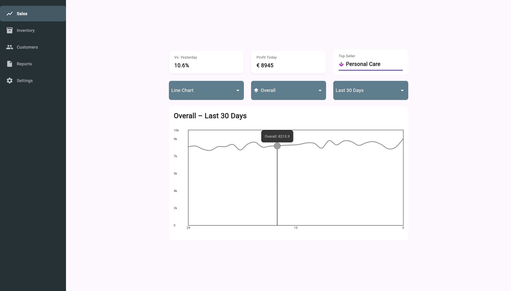

# Market Dashboard

An interactive sales analytics dashboard built with Flutter.

## Features

- Multiple chart visualizations (line, bar, donut)
- Category filtering and comparison
- Time range selection
- Interactive data exploration
- Responsive design

## Getting Started

1. **Prerequisites**
   - Flutter SDK 3.0+ 
   - Dart 3.0+

2. **Installation**
   ```bash
   git clone https://github.com/yourusername/dashboard_webapp.git
   cd dashboard_webapp
   flutter pub get
   ```

3. **Running**
   ```bash
   flutter run -d chrome
   ```

4. **Building for production**
   ```bash
   flutter build web
   ```

## Documentation

For detailed documentation on the project architecture and implementation, see [DOCUMENTATION.md](./DOCUMENTATION.md).

## Screenshots




